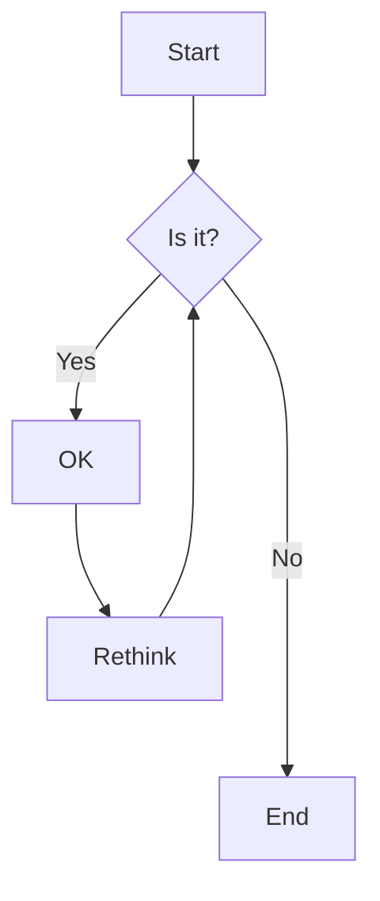

# Test

a

```mermaid
  graph TD;
      A-->B;
      A-->C;
      B-->D;
      C-->D;
      
```

```mermaid
  flowchart TD;
      A[Start] --> B{Is it?};
      B -->|Yes| C[OK];
      C --> D[Rethink];
      D --> B;
      B ---->|No| E[End];
```

_1-2-6-1.svg)
  