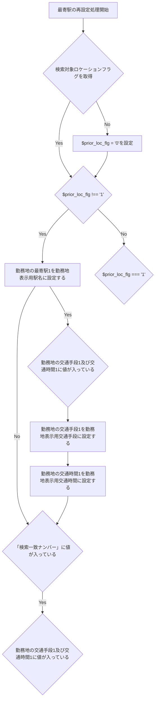
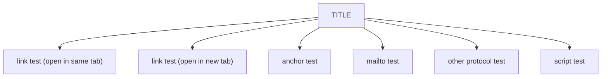

# Test

asdasdasd

## Test2
  
asdasdasdasdasdasd

### Test3

[#test1](#test)
[#test2](#test2)
[#test3](#test3)

asdasdasdasdasdasd

```mermaid
  flowchart TD;
      A[最寄駅の再設定処理開始] --> B{検索対象ロケーションフラグを取得};
      B -->|Yes| C{$prior_loc_flg !== '1'};
      B -->|No| D[$prior_loc_flg = '0'を設定];
      D --> C;
      C -->|Yes| E[勤務地の最寄駅1を勤務地表示用駅名に設定する];
      C -->|No| F{"$prior_loc_flg === '1'"};
      
      E -->|Yes| G{勤務地の交通手段1及び交通時間1に値が入っている};
      E -->|No| H{"「検索一致ナンバー」に値が入っている"};

      G --> I[勤務地の交通手段1を勤務地表示用交通手段に設定する];
      I --> J[勤務地の交通時間1を勤務地表示用交通時間に設定する];
      J --> H;
      H -->|Yes| K{勤務地の交通手段1及び交通時間1に値が入っている};
      click A "#test2" _top
      click B "https://github.com/Yuya-Takishima/Test/tree/test#test3" _top
      click C "https://github.com/Yuya-Takishima/Test/tree/test#test3" _top
```

```mermaid
  flowchart TD;
      A["link test (open in same tab)"]
      B["link test (open in new tab)"]
      C[anchor test]
      D[mailto test]
      E[other protocol test]
      F[script test]
      TITLE --> A & B & C & D & E & F
      click A "https://mermaid-js.github.io/mermaid/#/" "link test (open in same tab)"
      click B "https://mermaid-js.github.io/mermaid/#/" "link test (open in new tab)" _blank
      click C "#test2"
      click D "mailto:user@user.user" "mailto test"
      click E "notes://do-your-thing/id" "other protocol test"
      click F "javascript:alert('test')" "script test"

```
